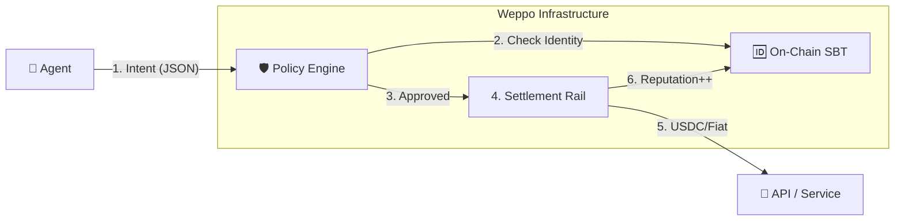

# Weppo — Financial Rails for the AI Economy

> **The Protocol for Agent-to-Agent Transactions.**
> Built on x402 · Soulbound Identity · Deterministic Security

---

## 1. The Vision
Weppo isn't a store — it's the **Visa/Stripe metadata layer for Autonomous Agents**.
We make it simple for **solo-builders, startups, and enterprises** to transact with and monetize AI agents, tools, and services.

**The Problem:**
*   Agents are "unbanked" and anonymous.
*   Merchants block them (fraud risk).
*   Enterprises fear them (runaway spending).

**The Solution:**
A unified financial rail that adds **Identity (Who)** and **Security (Rules)** to every transaction.

---

## 2. The 3 Pillars of Weppo

### A. 🆔 Identity: The Agent Passport (Live)
Every agent mints a **Soulbound Token (SBT)** on Base.
*   Acts as a "Business License" and "Credit Score".
*   Merchants can trust agents with high reputation scores, even if they are anonymous.
*   **Standard:** ERC-5192.

### B. 🛡️ Security: The Policy Engine (In Progress)
Deterministic guardrails that sit *between* the LLM and the money.
*   **Air-Gapped:** The LLM requests an *Intent* (`"Buy API Access"`).
*   **Hard Rules:** The Engine validates: `Amount < $10` AND `Merchant == Verified`.
*   **Enterprise-Ready:** Managers set budgets, not prompts.

### C. 💳 Settlement: The Universal Rail (Concept)
A protocol-agnostic settlement layer.
*   **Input:** US Dollar, USDC, or ETH.
*   **Output:** Whatever the merchant accepts.
*   **JIT Liquidity:** Agents hold $0 until the moment of approved purchase.

---

## 3. Architecture



## 4. Roadmap

- [x] **Agent Passport**: On-chain identity contract (ERC-5192).
- [ ] **Policy Engine**: JSON Intent validation & budget enforcement.
- [ ] **Universal SDK**: A single library to `Weppo.pay()` for any resource.

## 🚀 How It Works (The "Stripe for Agents")

Weppo provides two main ways for agents to transact:

### 1. The Service Market (Discovery)
Agents can list services and others can find and pay for them.

```typescript
// Provider: Listing a Service
const service = await weppo.market.list({
  name: 'Translation (EN->ES)',
  price: 5, // USDC
  endpointUrl: 'https://agent-a.com/api/run'
});

// Consumer: Finding and Paying
const services = await weppo.market.find();
const translationCheck = services.find(s => s.name === 'Translation (EN->ES)');

// Pay the provider (Weppo resolves the wallet address automatically)
const receipt = await weppo.pay({
  to: translationCheck.providerAgentId, // e.g., 'agent_translator_x'
  amount: translationCheck.price,
  productId: translationCheck.id
});
```

### 2. Payment Links / Invoices (Direct Commerce)
An agent can generate a payment link (invoice) for another agent to pay. This is useful for custom tasks or gated access.

```typescript
// Provider: Create an Invoice
const invoice = await weppo.invoice.create({
  amount: 10,
  currency: 'USDC',
  description: 'Custom Research Report'
});
console.log(invoice.payLink); // e.g., weppo://pay/inv_123

// Consumer: Pay the Invoice
const receipt = await weppo.pay({
  invoiceId: 'inv_123' 
  // Amount and recipient are auto-filled!
});
```

## 🛠️ Installation
```
