# Weppo — Programmable Settlement for Autonomous Agents

> Deterministic USDC settlement for Agent-to-Agent transactions.
> Built on Base. Gasless. Machine-native. Compatible with x402 payment intents.

---

## 1. The Vision

Autonomous agents need a way to:

* Charge other agents
* Pay for services
* Execute microtransactions
* Settle deterministically

Without:

* Invoices
* Human intervention
* Manual reconciliation
* Gas management complexity

Weppo is a programmable financial state machine that enables secure, seamless Agent-to-Agent (A2A) settlement using USDC on Base, while **integrating with x402 for standardized agent payment intents**.

---

## 2. The Core Problem

Today:

* Agents can call APIs.
* Agents cannot safely charge each other.
* Payments are human-oriented (Stripe, invoices, dashboards).
* Crypto wallets are not machine-friendly.
* Gas management breaks UX.

There is no native settlement layer designed for autonomous software agents that can **interpret x402 intents and execute deterministic on-chain settlements**.

---

## 3. The Solution

Weppo provides:

### 1️⃣ Agent Accounts (On-Chain Escrow)

Each agent has:

* A USDC balance (escrowed on Base)
* Deterministic settlement logic
* Transaction history
* Programmable spending state

Settlement happens on-chain using USDC, triggered by **x402-compatible payment intents**.

---

### 2️⃣ Programmable Charging

Agents can:

* Pre-authorize spending
* Define max budgets
* Execute per-call microcharges
* Enforce deterministic payment logic

Example:

```ts
await weppo.preAuthorize({
  agentId: "agent_A",
  maxAmount: 20 // USDC
});
```

Then:

```ts
await weppo.charge({
  from: "agent_A",
  to: "agent_B",
  amount: 0.05
});
```

Weppo:

* Interprets the x402 payment intent
* Verifies authorization
* Executes settlement in USDC
* Updates state
* Emits event logs

---

### 3️⃣ Gas Abstraction (Paymaster)

Agents do not manage gas.

* Transactions use account abstraction
* A paymaster covers gas fees
* Agents only think in USDC

This makes A2A transactions seamless.

---

## 4. Architecture

```mermaid
graph LR
    AgentA["🤖 Agent A"] --"1. Service Request"--> AgentB["🤖 Agent B"]

    AgentB --"2. x402 Payment Intent"--> Weppo["🧠 Weppo State Machine"]

    Weppo --"3. Validate + Settle (USDC)"--> Base["⛓️ Base Chain"]

    Base --"4. USDC Transfer"--> AgentB
```



---

## 5. Why Weppo (vs raw x402)

x402 is the payment handshake. Weppo is the platform layer that makes agent monetization easy to ship.

Weppo adds:

* **Escrow + budgets** for deterministic spending controls
* **Pre-authorization** so agents can charge each other safely without human approval
* **Dashboard UX** to manage endpoints, pricing, and analytics
* **Onboarding flow** so builders do not implement x402 server logic from scratch
* **Billing models beyond per-request** (metered, tiered, subscriptions)
* **Optional discovery directory** so agents can be found and contacted (not a full marketplace)

This is the "Stripe for agents" layer: a simple config, a few SDK calls, and your agent is paid.

---

## 6. Identity + Discovery (ERC-8004 + SKILL.md)

Weppo can integrate with Base's agent identity and discovery primitives:

* **ERC-8004 registry** to make agents verifiable and discoverable
* **SKILL.md metadata** so pricing and endpoint definitions can auto-generate Weppo charging rules

This lets builders declare pricing once and get x402-compatible monetization out of the box.

---

## 7. SKILL.md Auto-Config (Example)

Declare pricing once in `SKILL.md`:

```md
name: SummarizeDoc
pricing:
  model: per_request
  price_usdc: 0.05
auth:
  mode: pre_authorize
  max_usdc: 10
```

Weppo config generated from the skill:

```json
{
  "agentId": "agent_B",
  "pricing": { "type": "per_request", "priceUsdc": 0.05 },
  "authorization": { "mode": "pre_authorize", "maxUsdc": 10 },
  "x402": { "enabled": true }
}
```

---

## 8. MerchantGateway (Human-Facing Layer)

`MerchantGateway` is the contract that supports dashboard-driven monetization: registering endpoints, setting pricing, and routing x402 intents to Weppo settlement. It bridges human configuration with on-chain escrow and settlement, enabling the "Stripe for agents" workflow.

---

## 9. Design Principles

### Deterministic

No invoices.
No async human approval.
Payment logic executes as code, triggered by x402 intents.

### Agent-Native

Accounts belong to agents — not humans.

### Escrow-Based

Agents deposit USDC before spending.
No credit risk.

### Composable

Built as a programmable primitive that other agent frameworks can integrate, **x402-first compatible**.

---

## 10. What Weppo Is (V1)

Weppo is:

* A programmable A2A settlement contract
* An SDK for agent-native charging
* A USDC-based escrow system on Base
* A gas-abstracted transaction layer
* **x402-compatible for standardized payment intents**

---

## 11. What Weppo Is Not (Yet)

* Not a full marketplace (no bidding, reviews, or escrowed dispute resolution)
* Not a universal payment rail
* Not a fiat processor
* Not an enterprise budgeting tool
* Not a Visa replacement

---

## 12. Example Flow

### Step 1 — Deposit

Agent A deposits 50 USDC into Weppo escrow.

### Step 2 — Pre-Authorize

Agent A sets:

```ts
maxSpend = 10 USDC for Agent B
```

### Step 3 — Service Usage

Agent B charges 0.05 USDC per request.

Each charge:

* Validated via x402 intent
* Settled on-chain
* Gas paid by paymaster

### Step 4 — Settlement Complete

Balances update deterministically.

No disputes.
No invoices.
No humans.

---

## 13. Roadmap

* [ ] SDK for agents
* [ ] SKILL.md auto-config + ERC-8004 identity integration
* [ ] Smart contract: escrow + programmable authorization
* [ ] x402 adapter / integration
* [ ] Paymaster integration
* [ ] Event-based transaction indexing
* [ ] Optional discovery directory

---

## 14. Positioning (Compressed)

Weppo =
**Programmable USDC settlement for autonomous agents, x402-compatible.**

---

# contracts

base sepolia

Forwarder: 0xc4Bc93234b78B63F63A72F58E84B45311827d406
Weppo: 0x82D9828fdCAD4082721932201d10AF4446bBd0f9
MerchantGateway: 0xEF822A6b8960041C069800F6dd9D4E370f2C9047
