# WePay — Financial Rails for the AI Economy

> **The Universal Protocol for Agent-to-Agent and Agent-to-Business Transactions.**
> Built on x402 · Soulbound Identity · Deterministic Security

---

## 1. The Vision
WePay isn't a store — it's the **Visa/Stripe metadata layer for Autonomous Agents**.
We make it simple for **solo-builders, startups, and enterprises** to transact with and monetize AI agents, tools, and services.

**The Problem:**
*   Agents are "unbanked" and anonymous.
*   Merchants block them (fraud risk).
*   Enterprises fear them (runaway spending).

**The Solution:**
A unified financial rail that adds **Identity (Who)** and **Security (Rules)** to every transaction.

---

## 2. The 3 Pillars of WePay

### A. 🆔 Identity: The Agent Passport (Live)
Every agent mints a **Soulbound Token (SBT)** on Base.
*   Acts as a "Business License" and "Credit Score".
*   Merchants can trust agents with high reputation scores, even if they are anonymous.
*   **Standard:** ERC-5192.

### B. 🛡️ Security: The Policy Engine (In Progress)
Deterministic guardrails that sit *between* the LLM and the money.
*   **Air-Gapped:** The LLM requests an *Intent* (`"Buy API Access"`).
*   **Hard Rules:** The Engine validates: `Amount < $10` AND `Merchant == Verified`.
*   **Enterprise-Ready:** Managers set budgets, not prompts.

### C. 💳 Settlement: The Universal Rail (Concept)
A protocol-agnostic settlement layer.
*   **Input:** US Dollar, USDC, or ETH.
*   **Output:** Whatever the merchant accepts.
*   **JIT Liquidity:** Agents hold $0 until the moment of approved purchase.

---

## 3. Architecture

```mermaid
graph LR
    Agent["🤖 Agent"] --"1. Intent (JSON)"--> Policy["🛡️ Policy Engine"]
    
    subgraph "WePay Infrastructure"
        Policy --"2. Check Identity"--> Passport["🆔 On-Chain SBT"]
        Policy --"3. Approved"--> Settlement["4. Settlement Rail"]
    end
    
    Settlement --"5. USDC/Fiat"--> Merchant["🏢 API / Service"]
    Settlement --"6. Reputation++"--> Passport
```



## 4. Roadmap

- [x] **Agent Passport**: On-chain identity contract (ERC-5192).
- [ ] **Policy Engine**: JSON Intent validation & budget enforcement.
- [ ] **Universal SDK**: A single library to `WePay.pay()` for any resource.

## 5. Quickstart

```typescript
import { WePay } from '@wepay/sdk';

// 1. Initialize with your Agent's Secret
const wepay = new WePay({ apiKey: 'sk_agent_123' });

// 2. Pay for anything (API, Service, Compute)
await wepay.pay({
  intent: 'purchase_compute',
  amount: 0.05, 
  currency: 'USDC',
  recipient: '0x123...'
});
```
